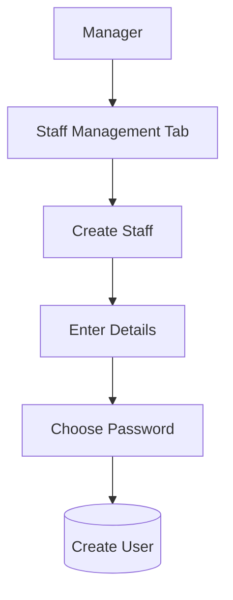

# Architecture Decisions

## Backend Architecture
- **Framework**: FastAPI was chosen for its excellent performance, built-in async support, and automatic OpenAPI generation.
- **ORM**: SQLAlchemy 2.0 with `asyncpg` was selected to ensure high concurrency handling and strong typing for database models.
- **Database**: PostgreSQL is used to enforce strong relational constraints and data integrity.

## Concurrency and Shift Claiming Strategy
- **Problem**: Multiple staff members could attempt to claim the same shift role simultaneously, leading to race conditions where a shift becomes overbooked.
- **Solution**: The application uses explicit row-level locking via SQL transactions (`SELECT ... FOR UPDATE` via SQLAlchemy's `with_for_update()`). When a claim request is received, the backend:
  1. Starts a database transaction.
  2. Locks the specific `shifts` row.
  3. Recalculates the current number of claims for the requested role.
  4. Validates that the role is not fully staffed and that the user does not have an overlapping shift.
  5. Inserts the claim and commits the transaction.
- **Tradeoff**: Row-level locking slightly reduces throughput on a single shift record, but guarantees 100% data integrity without needing complex distributed locks (e.g., Redis).

## CSV Import Strategy
- **Normalization**: Roles are normalized (e.g., `DR`, `Doctor` -> `doctor`) to maintain consistent requirement records.
- **Deduplication / Merging**: 
  - If a CSV contains multiple rows for the same shift (same date, start time, and end time), the importer groups them into a single `Shift` record.
  - If the same role is listed multiple times for the same shift, their counts are added together.
  - All merging actions and rejections (e.g., invalid date formats) are recorded in the `import_errors` table and linked to an `ImportReport` for the manager to review.

## Shift Editing Strategy (Future Implementation Note)
- **Behavior**: When a manager edits a shift's times or role requirements, all existing claims for that shift must be re-validated.
- **Process**:
  1. If the required count for a role is reduced below the current number of claims, the most recent claims (LIFO) should be removed until the constraint is met.
  2. If the shift time changes, the system must check if the new time causes overlaps for any currently assigned staff. If an overlap occurs, their claim is removed.
  3. All removed claims must trigger a notification (or a database record) explaining the reason for removal to the manager and the affected staff.

## Frontend State Management
- **Local State**: Zustand is used for authentication state (`useAuthStore`) because it provides a simple, boilerplate-free way to manage the JWT token and user profile globally without needing context providers wrapping the entire app.
- **Server State**: TanStack Query (React Query) is used for all data fetching (shifts, imports) to handle caching, loading states, and automatic refetching upon mutations (e.g., claiming a shift).

## User Creation Strategy

There are two primary ways a staff account can be created in the system.

### 1. Staff Imported from CSV
When the application is seeded (or when a manager uploads a staff CSV), the importer creates staff accounts automatically.

**Flow:**
```mermaid
graph TD
    A[staff.csv] --> B[Import Service]
    B --> C[Normalize & Validate]
    C --> D[Create Staff User]
    D --> E[Password = "password123"]
    E --> F[Hash with bcrypt]
    F --> G[(Save to Database)]
```

**Default values:**
| Field | Value |
| :--- | :--- |
| **Role** | staff |
| **Profession** | From CSV |
| **Password** | `password123` (hashed before storing) |
| **Status** | Active |

> [!IMPORTANT]
> The password is never stored as plain text. Only the bcrypt hash of "password123" is saved to the database.

### 2. Manager Creates Staff Manually
The manager can add new staff members directly from the application via the Staff Management dashboard.

**Flow:**


**Form Requirements:**
- Name *
- Email *
- Profession * (Doctor / Nurse / Receptionist)
- Password *
- Confirm Password *

Unlike imported users, the manager chooses the initial password manually.

### Manager Permissions
The manager is empowered to:
- Create staff
- Set the initial password
- Edit name, email, and profession
- Remove / Deactivate staff

> [!NOTE]
> The manager cannot view existing passwords, because only password hashes are stored in the database.

### Why this is a good design
- ✅ **Satisfies Requirements:** Fulfills the assignment's requirement to seed staff logins effectively.
- ✅ **Immediate Usability:** Makes imported accounts immediately usable with a known, communicated default password.
- ✅ **Manager Flexibility:** Allows managers to create new staff accounts on the fly without editing and uploading CSV files.
- ✅ **Unified Data Model:** Uses a single `users` table for both imported and manually created staff, keeping relational logic clean.
- ✅ **Security:** Stores all passwords securely as bcrypt hashes.
- ✅ **Pragmatic Simplicity:** Keeps the system simple, cohesive, and highly practical for a production-ready application.
